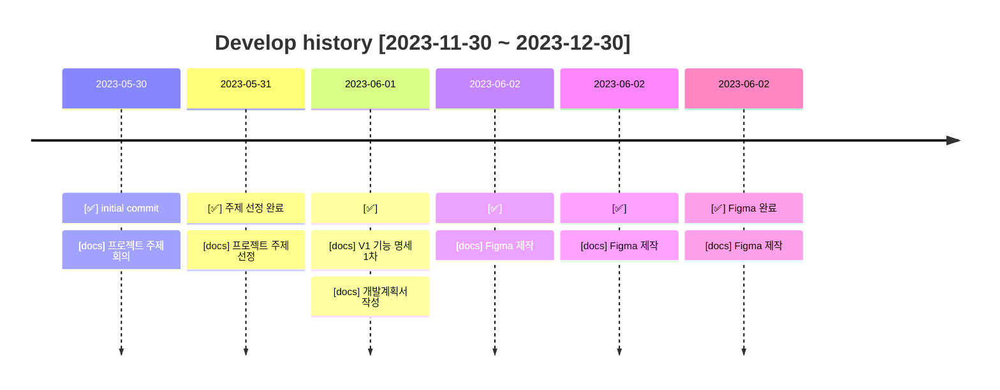
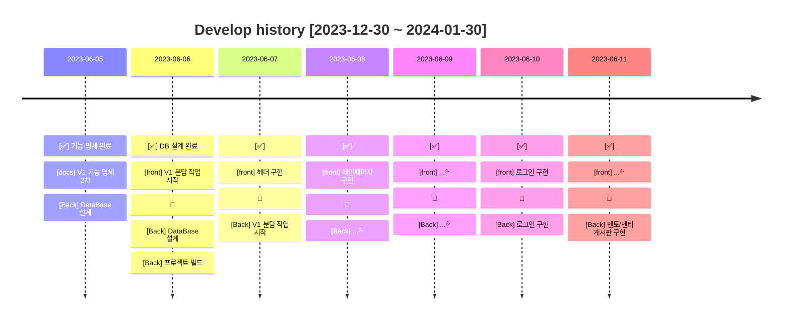
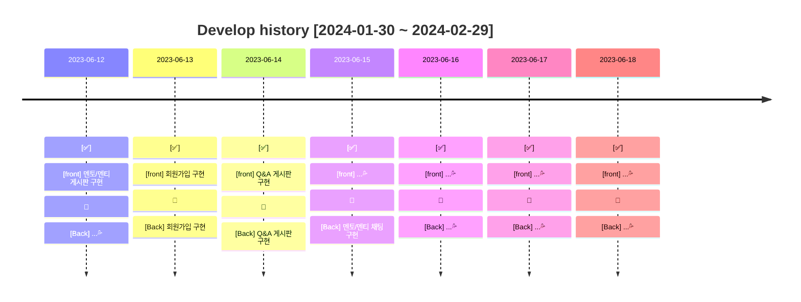
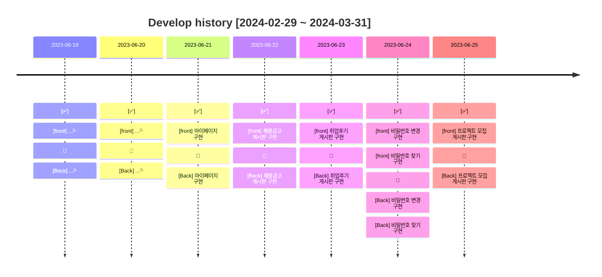
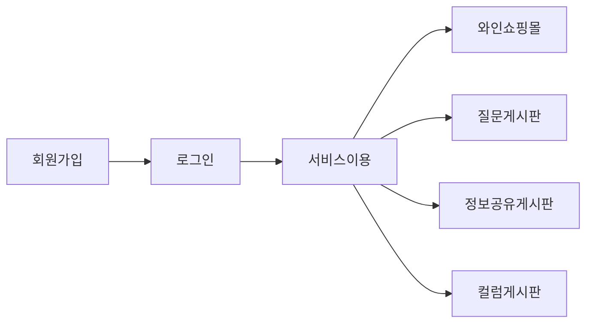
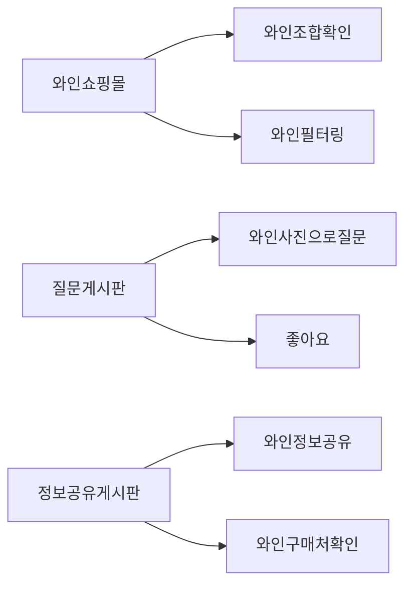

# WOWIN

 

### LINK 👉  oslob.com 

※MainPage
   

### 목차

1. [서비스 개요](#📢-서비스-개요)
2. [팀원 소개](#👋-팀원)
3. [기술 스택](#🔨-기술-스택)
4. [주요 기능 및 로직 소개](#🎯-주요-기능-및-로직-소개)
5. [개발 이력](#📜-개발-이력)
6. [버전 정보](#💡-버전-정보)
7. [DataBase](#⚙-DataBase)

  

### 📢 서비스 개요

---

#### 와인,  어떻게 마셔야할 지 고민이 있으신가요?🥺

`WOWIN`은 초보자부터 전문가까지 모두를 위한 다양한 와인을 보유하고 있습니다. 당신의 취향과 예산에 맞는 와인을 찾을 수 있도록 도와드리겠습니다.

그리고 우리의 커뮤니티는 와인에 대한 지식을 공유하고 함께 성장해 와인 초보자들을 위한 팁과 다양한 와인에 대한 리뷰를 통해 여러분의 와인 여정을 더욱 즐겁게 만들어줄 것입니다.

와인 초보자들이 쉽게 접할 수 있도록 필요한 서비스를 간편하게 이용할 수 있도록 개발하였습니다.

### WOWIN의 회원이 되어보실래요?😁

  

### 👋 팀원

---

| 이름        | 담당             | GITHUB                          |
|-----------|----------------|---------------------------------|
| 👩‍💻 김영재 | <b>✨FRONT</b>  | https://github.com/Yjason-K     |
| 👨‍💻 김태근 | <b>✨FRONT</b>  | https://github.com/taegeun1111  |
| 👨‍💻 정동관 | <b>✨FRONT</b>  | https://github.com/1gizmo       |
| 👩‍💻 남환준 | <b>✨BACK</b>   | https://github.com/onlyjoon     |
| 👩‍💻 이동우 | <b>✨BACK</b>   | https://github.com/ldw9571      |
| 👩‍💻 조경훈 | <b>✨BACK</b>   | https://github.com/oslob99      |
| 👩‍💻 이한준 | <b>✨DevOps</b> | https://github.com/leehanjun506 |

  

## 🔨 기술 스택

--- 
#### 📜 FRONT

  
  
  
  

#### 🛠️ BACK

  
  
  
  
  
  
  

#### 📀 DB

  

#### ✂️ Deployment

  
  

#### ✂️ Tool

  
  

#### ⭐️ etc

  
  
  
  
  
  
  
  
  
  
  

 

  

### 🎯 주요 기능 및 로직 소개

---

### 📄 회원가입 & 로그인
- 회원은 일반 회원가입 및 로그인이 가능합니다.

### 📄 와인 쇼핑몰
- 회원이 현재 참여 중인 멘토링, 프로젝트를 확인할 수 있습니다.
- 회원이 모든 게시판에 작성한 게시글을 확인할 수 있습니다.
- 회원 정보 수정이 가능합니다.
  1. 이름, 닉네임, 생년월일, 개발 포지션, 경력, 프로필사진을 수정할 수 있습니다.
- 비밀번호 변경이 가능합니다.
  1. 기존 비밀번호를 입력하여 검증 후, 새로운 비밀번호로 변경할 수 있습니다.

### 📄 와인 질문 게시판
- 사용자가 게시글을 작성해 직접 멘토가 되어 멘티와 함께 성장하는 멘토링시스템, 1 대 1 실시간 채팅과 함께 하세요.
- 프론트엔드, 백엔드, 취업진로, 기타 순으로 중복 정렬해서 게시글을 볼 수 있습니다.
- 작성자만 상세페이지에서 수정, 삭제가 가능합니다.
- 작성자가 멘토가 되어 멘티의 채팅방 조회, 채팅메세지들을 볼 수 있습니다.
- 멘토가 멘티들을 확정해 멘티의 목록을 확인할 수 있습니다.
- 멘티는 멘토에게 신청하기를 눌러 1 대 1 실시간 채팅을 할 수 있습니다.

### 📄 와인 정보공유 게시판
- 키워드(제목, 내용)를 통해 게시글을 조회 할 수 있습니다
  - 게시글은 인기순과 좋아요 순으로 화면에 표시됩니다
- 회원은 프로젝트 모집 게시글 작성이 가능합니다
  - 작성자만 삭제, 수정이 가능합니다
- 게시글에 좋아요를 할 수 있습니다
  - 한 회원당 게시글에 한번의 좋아요만 누를 수 있습니다
- 회원은 게시글을 클릭하면 상세보기 확인할 수 있으며, 모집글에 신청을 할 수 있습니다
  - 본인의 게시글에는 신청을 할 수 없습니다
- 회원은 [ 남은 자리, 참가 인원, 마감일자 , 인기순] 의 조건을 통해 빠르게 시작할 수 있는 프로젝트를 매칭 받을 수 있습니다

### 📄 와인 컬럼 게시판
- 회원은 질문 게시글 작성이 가능합니다.
  - 게시글과 관련된 해시태그를 10개까지 작성할 수 있습니다.
- 회원은 답변 댓글 작성이 가능합니다.
- 게시글 작성자는 답변 댓글을 채택할 수 있습니다.
  - 댓글이 채택되면, 게시글은 채택완료 상태로 변경됩니다.
  - 채택완료 후 다른 댓글은 채택할 수 없습니다.
- 회원은 게시글 수정, 삭제가 가능합니다.
  - 채택완료 후에는 게시글 수정, 삭제가 불가능합니다.
- 회원은 댓글 수정, 삭제가 가능합니다.
  - 게시글이 채택완료된 후에는 댓글 수정, 삭제가 불가능합니다.
- 회원은 게시글 검색이 가능합니다.
  - 게시글의 제목, 내용, 해시태그로 검색이 가능합니다.
- 회원은 주간 인기글을 조회할 수 있습니다.
  - 월요일 0시부터 일요일 11시 59분까지의 주간 조회수를 기준으로 갱신되는 인기글을 조회할 수 있습니다.

### 📜 개발 이력

---

### 🕘 개발 기간 (약 4 달 소요)
2023-11-30 ~ 2024-03-31

 

  

### 💡 버전 정보

---

#### ✅ v1.0.0

---

  

### ⚙ DataBase

---
#### MSA 설계로 서비스가 분리되어 데이터베이스가 나뉘어져 있습니다.
 

#### 회원

 

#### 와인쇼핑몰

 

#### 질문 게시판

 

#### 정보공유 게시판

